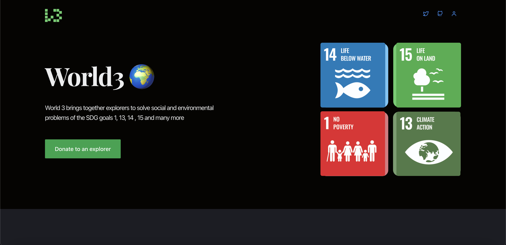

<p align="center">
  <a href="https://github.com/king-technologies/Project-Initiator" title="Project Initiator">
    
  </a>
</p>
<h1 align="center">🌟 World3 🌍 🌟</h1>

<p align="center"> 
<a href="https://github.com/pakariisbum/world3/blob/master/LICENSE" title="License">

</a>
<a href="https://github.com/pakariisbum/world3/fork" title="Forks">

</a>
<a href="https://github.com/pakariisbum/world3" title="Stars">

</a>
<a href="https://img.shields.io/github/stars/pakariisbum/world3/issues" title="Issues">

</a>

</a>
</p>

<p align="center" title="Project Initiator"></p>

<h2 align="center">🌐 Links 🌐</h2>
<p align="center">
    <a href="https://youtu.be/Omhoy1e5pNg" title="">🖥️ Video</a>
    .
    <a href="https://world3s.netlify.app/" title="">🔗 Website</a>
    ·
    <a href="https://github.com/pakariisbum/world3" title="">📂 Repo</a>
    ·
    <a href="https://github.com/pakariisbum/world3" title="🐛Report Bug/🎊Request Feature">🚀 Got Issue</a>
</p>

## 💪 Motivation

When I was a kid, I used to wonder how long the earth has been around, how creatures underwater survive, why animals go extinct, and what causes rain to fall. When I started high school, I realized that most of the answers I was looking for were right in front of me. Our actions have a significant impact on our world. How can we address these concerns? Individuals must dedicate themselves as explorers to assist in the management of these environmental and social issues.

## 🚀 How it works

World 3 is a web 3.0 platform that will bring together explorers to solve social and environmental problems of the SDG goals. Our mission is to use blockchain to achieve real world impact, especially in areas where there is no other solution. We believe that the technology exists today, and more importantly, we have built World3 to be easily adopted by anyone that needs a tool for managing social issues.

Follow the steps below to get started with web3.

- **Click on the profile icon at the top right corner of the homepage**

- **Setup a your profile**

- **Setup a project.**

- **Get Sponsorship from user all over the world**

## 🦋 Prerequisite

- [Nodejs](https://nodejs.org/en// "Node") Installed

- [Git](https://git-scm.com/ "Git OFficial") Installed

- [npm](https://www.npmjs.com/ "npm ") Installed

- [Hardhat](https://hardhat.org/ "Hardhat ") Installed

## 🛠️ Installation Steps

1. Clone the repository

```Bash
git clone https://github.com/pakariisbum/world3
```

2. Change the working directory

```Bash
cd world3
```

3. Start the local Hardhat node

```Bash
npx hardhat node
```

4. With the network running, deploy the contracts to the local network in a separate terminal window

```Bash
npx hardhat run scripts/deploy.js --network localhost
```

5. Start the app

```Bash
npm run start
```

**🎇 You are Ready to Go!**

## ⚙️ Configuration

The chain ID should be 80001. If you have a localhost rpc set up, you may need to overwrite it.

<p align="center" title="Project Initiator"></p>

To deploy to Polygon test or main networks, update the configurations located in hardhat.config.js to use a private key and, optionally, deploy to a private RPC like Infura.

```Bash
require('@nomiclabs/hardhat-waffle');
const privateKey = 'xx';
const projectId = 'xx';

module.exports = {
  defaultNetwork: 'hardhat',
  networks: {
    hardhat: {
      chainId: 1337,
    },
    matic: {
      url: 'https://polygon-mumbai.g.alchemy.com/v2/{projectId}',
      accounts: [privateKey],
    },
  },
  solidity: {
    version: '0.8.4',
    settings: {
      optimizer: {
        enabled: true,
        runs: 200,
      },
    },
  },
};
```

## 👷 Built with

- [Solidity](https://docs.soliditylang.org/en/v0.8.17/ "Solidity"): as Main Coding Language for writing smart contract

- [ReactJs](https://reactjs.org/ "React Js"): as Main Coding Language for Creating The UI components (Front End)

- [TailwindCss](https://tailwindcss.com/ "Tailwind Css"): as Main Coding Language for styling UI components

- [IPFS](https://ipfs.tech/ "IPFS"): For Storing of files

- [Web3 Storage](https://www.google.com/search?q=web3storage "Web3 Storage"): For Storing of files

- [Github](https://github.com/ "Github") : For Repo Storage and source code management

- [Git](https://git-scm.com/ "Git") : For Version Control System

## 📂 Contributing

Contributions are what make the open source community such an amazing place to learn, inspire, and create. Any contributions you make are greatly appreciated.

If you have a suggestion that would make this better, please fork the repo and create a pull request. You can also simply open an issue with the tag "enhancement". Don't forget to give the project a star! Thanks again!

- Fork the Project

- Create your Feature Branch (git checkout -b feature/AmazingFeature)

- Commit your Changes (git commit -m 'Add some AmazingFeature')

- Push to the Branch (git push origin feature/AmazingFeature)

- Open a Pull Request

## 🎊 Future Updates

- [ ] Mint memories as an NFT for explorers

- [ ] A mapping algorithm that displays explorers close to your location

## 🧑🏻 Author

**Pakari Isbum**

- 🌌 [Profile](https://github.com/pakariisbum "Pakari Isbum")

- 🏮 [Email](pakariisbum@gmail.com "Hi!")

<h2 align="center">🤝 Support</h2>

<p align="center">🎀 Contributions (<a href="https://guides.github.com/introduction/flow" title="GitHub flow">GitHub Flow</a>), 🔥 issues, and 🥮 feature requests are most welcome!</p>

<p align="center">💙 If you like this project, Give it a ⭐ and Share it with friends!</p>

<p align="center">Made with Solidity and Javascript & ❤️ </p>
