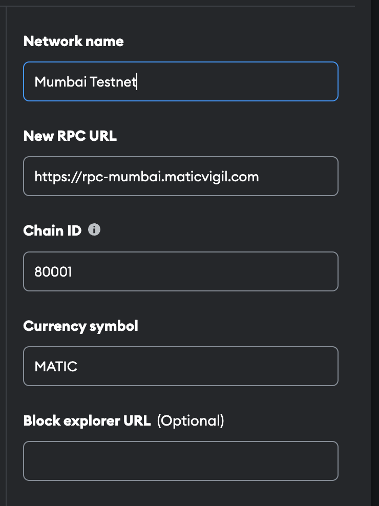

<p align="center">
  <a href="https://github.com/king-technologies/Project-Initiator" title="Project Initiator">
    
  </a>
</p>
<h1 align="center">🌟WIT(Women In Tech) 🌍 🌟</h1>

<p align="center"> 
<a href="https://github.com/stugufaka/women_in_tech/blob/master/LICENSE" title="License">

</a>
<a href="https://github.com/stugufaka/women_in_tech/fork" title="Forks">

</a>
<a href="https://github.com/stugufaka/women_in_tech" title="Stars">

</a>
<a href="https://img.shields.io/github/stars/stugufaka/women_in_tech/issues" title="Issues">

</a>

</a>
</p>

<h2 align="center">🌐 Links 🌐</h2>
<p align="center">
    <a href="https://youtu.be/Omhoy1e5pNg" title="">🖥️ Video</a>
    .
    <a href="https://women_in_techs.netlify.app/" title="">🔗 Website</a>
    ·
    <a href="https://github.com/stugufaka/women_in_tech" title="">📂 Repo</a>
    ·
    <a href="https://github.com/stugufaka/women_in_tech" title="🐛Report Bug/🎊Request Feature">🚀 Got Issue</a>
</p>

## 💪 Motivation

As a young girl, my inquisitive mind always pondered the mysteries of our planet. I wondered about the Earth's age, the resilience of underwater life, the tragic loss of animal species, and the science behind rainfall. Little did I know that the answers to these questions were waiting to be discovered in the world of technology. It was during my high school years that I realized the transformative potential of women in tech to address these concerns and make a lasting impact.

As women in tech, we possess unique perspectives and talents that can revolutionize the way we approach environmental and social issues. We have the power to channel our passion for exploration into finding innovative solutions and shaping a sustainable future. By leveraging technology, we can unlock the secrets of our planet, uncover patterns, and develop tools to mitigate the challenges we face.

To address these concerns, we must embrace our role as trailblazers and champions of change. We must dedicate ourselves as women explorers, committed to managing and preserving our environment through the power of technology. By advocating for diversity, conducting research, and fostering collaboration, we can drive positive transformation in our communities.

Together, as women in tech, let us embark on this vital journey to protect our planet. With our collective knowledge, skills, and unwavering determination, we can lead the way towards a more sustainable and inclusive future, leaving a lasting legacy for generations of women to come.

## 🚀 How it works

WIT(Women In Tech) 3 is a web 3.0 platform that will bring together developers to solve social and environmental problems of the SDG goals. Our mission is to use blockchain to achieve real world impact, especially in areas where there is no other solution. We believe that the technology exists today, and more importantly, we have built Woment In Tech to be easily adopted by anyone that needs a tool for managing social issues.

Follow the steps below to get started with web3.

- **Click on the profile icon at the top right corner of the homepage**

- **Setup a your profile**

- **Setup a project.**

- **Get Sponsorship from user all over the world**

## 🦋 Prerequisite

- [Nodejs](https://nodejs.org/en// "Node") Installed

- [Git](https://git-scm.com/ "Git OFficial") Installed

- [npm](https://www.npmjs.com/ "npm ") Installed

- [Hardhat](https://hardhat.org/ "Hardhat ") Installed

## 🛠️ Installation Steps

1. Clone the repository

```Bash
git clone https://github.com/stugufaka/women_in_tech
```

2. Change the working directory

```Bash
cd women_in_tech
```

3. Start the local Hardhat node

```Bash
npx hardhat node
```

4. With the network running, deploy the contracts to the local network in a separate terminal window

```Bash
npx hardhat run scripts/deploy.js --network localhost
```

5. Start the app

```Bash
npm run start
```

**🎇 You are Ready to Go!**

## ⚙️ Configuration

The chain ID should be 80001. If you have a localhost rpc set up, you may need to overwrite it.

<p align="center" title="Project Initiator"></p>

To deploy to Polygon test or main networks, update the configurations located in hardhat.config.js to use a private key and, optionally, deploy to a private RPC like Infura.

```Bash
require('@nomiclabs/hardhat-waffle');
const privateKey = 'xx';
const projectId = 'xx';

module.exports = {
  defaultNetwork: 'hardhat',
  networks: {
    hardhat: {
      chainId: 1337,
    },
    matic: {
      url: 'https://polygon-mumbai.g.alchemy.com/v2/{projectId}',
      accounts: [privateKey],
    },
  },
  solidity: {
    version: '0.8.4',
    settings: {
      optimizer: {
        enabled: true,
        runs: 200,
      },
    },
  },
};
```

## 👷 Built with

- [Solidity](https://docs.soliditylang.org/en/v0.8.17/ "Solidity"): as Main Coding Language for writing smart contract

- [ReactJs](https://reactjs.org/ "React Js"): as Main Coding Language for Creating The UI components (Front End)

- [TailwindCss](https://tailwindcss.com/ "Tailwind Css"): as Main Coding Language for styling UI components

- [IPFS](https://ipfs.tech/ "IPFS"): For Storing of files

- [Web3 Storage](https://www.google.com/search?q=web3storage "Web3 Storage"): For Storing of files

- [Github](https://github.com/ "Github") : For Repo Storage and source code management

- [Git](https://git-scm.com/ "Git") : For Version Control System

## 📂 Contributing

Contributions are what make the open source community such an amazing place to learn, inspire, and create. Any contributions you make are greatly appreciated.

If you have a suggestion that would make this better, please fork the repo and create a pull request. You can also simply open an issue with the tag "enhancement". Don't forget to give the project a star! Thanks again!

- Fork the Project

- Create your Feature Branch (git checkout -b feature/AmazingFeature)

- Commit your Changes (git commit -m 'Add some AmazingFeature')

- Push to the Branch (git push origin feature/AmazingFeature)

- Open a Pull Request

## 🎊 Future Updates

- [ ] Mint memories as an NFT for explorers

- [ ] A mapping algorithm that displays explorers close to your location

## Author

**Eva Mariwa**

- 🌌 [Profile](https://github.com/stugufaka "Stugu Faka")

- 🏮 [Email](evamariwa123@gmail.com "Hi!")

<h2 align="center">🤝 Support</h2>

<p align="center">🎀 Contributions (<a href="https://guides.github.com/introduction/flow" title="GitHub flow">GitHub Flow</a>), 🔥 issues, and 🥮 feature requests are most welcome!</p>

<p align="center">💙 If you like this project, Give it a ⭐ and Share it with friends!</p>

<p align="center">Made with Solidity and Javascript & ❤️ </p>
